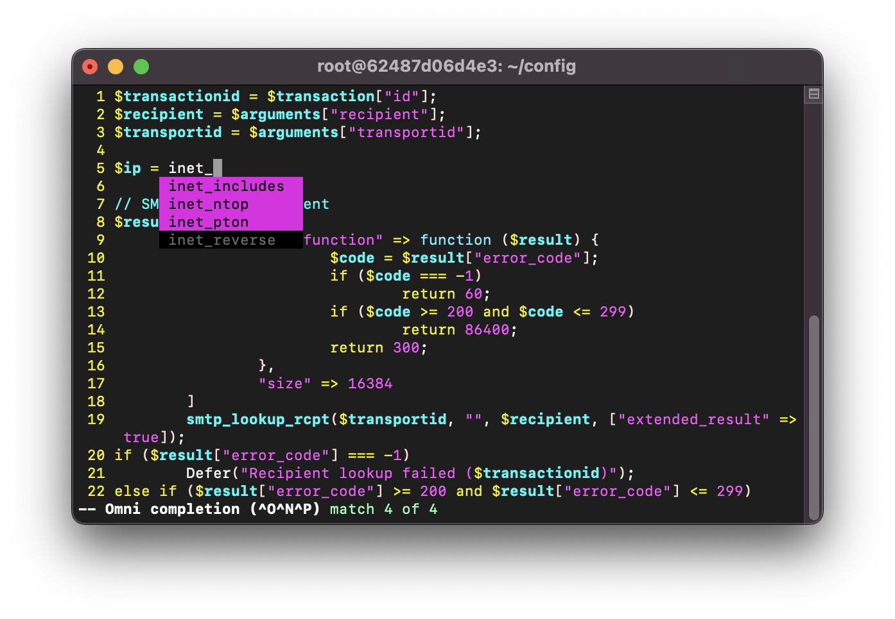

# HSL plugin for Vim

This plugin adds [HSL](https://docs.halon.io/hsl/) (Halon Scripting Language) support to [Vim](https://www.vim.org).

## Features

* Syntax highlighting
* Indentation
* Completion
  * Covers the entire standard library

## Installation

To install the plugin use the following command.

```bash
git clone https://github.com/halon/vim-hsl.git ~/.vim/pack/vendor/start/vim-hsl
```

To enable it add the following to your `~/.vimrc` file.

```vim
syntax on
filetype plugin indent on
```

</details>

## Screenshots
<p align="center">
  
</p>